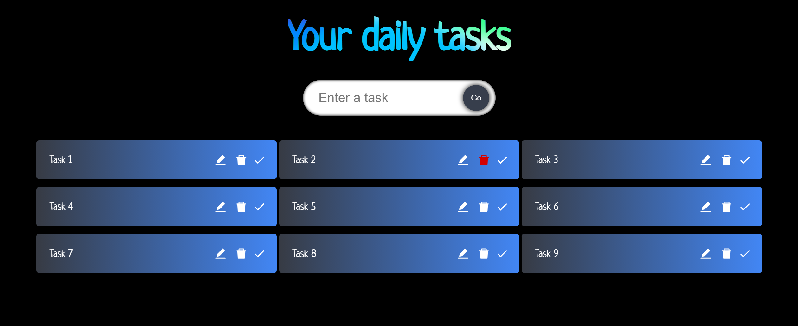

  <h2>Task Manager</h2>
  Add/delete/edit one or more tasks.

 
This is my first TypeScript project with React.js.
I will implement redux toolkit and add new feautures soon.
 
Technologies used: React.js, TypeScript, CSS. Fully responsive.

Open this link [https://todo-app-typescript-andrei.vercel.app/](https://todo-app-typescript-andrei.vercel.app/) to view it.

## Site images

## Available Scripts

Open the project directory and there you can type (using Git Bash):

### `npm install`
### `npm start`

Open this link [http://localhost:3000](http://localhost:3000) to view it in your browser.

